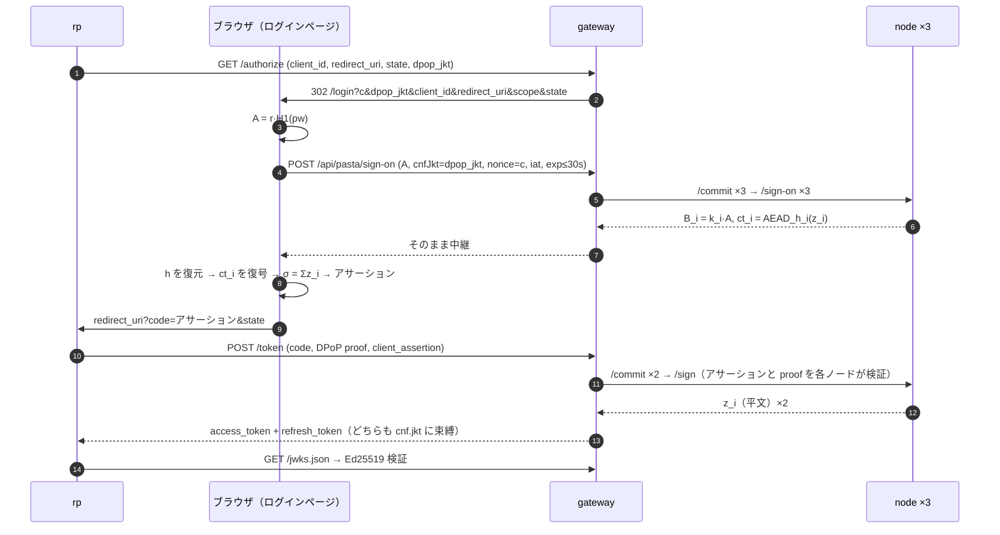

# decentralized_idp

パスワードを誰にも見せずにログインし、単独では誰もトークンを発行できない OAuth 2.0 認可サーバー。PASTA（閾値 OPRF）と FROST（閾値 Ed25519 署名）を組み合わせ、n 台のアイデンティティノードのうち t 台が協力したときだけ署名が成立する。RP（relying party）から見えるのは普通の OAuth 認可コードフロー + DPoP。

```
ブラウザ ──→ rp ──→ gateway ──→ node1 / node2 / node3
```

- **ブラウザ**でパスワードはブラインドされ、ノードが返す暗号化された署名シェアを復号・合成して**認証アサーション**（= 認可コード）を組み立てる。復号できるのはパスワードを知る者だけ。登録もブラウザが行い、ユーザーごとの TOPRF 鍵を作って分割し、各ノードに直接渡す
- **gateway** は状態を一切持たない OAuth サーバー。ノードへの中継とシェアの合成だけを行い、シェアの復号も単独署名もできない
- **node** はグループ署名鍵のシェア `s_i` と、登録で受け取ったユーザーごとの TOPRF シェア `k_i` を持つ。パスワードもトークンも見ない
- **rp** は DPoP 鍵とクライアント認証鍵（`private_key_jwt`）を持ち、認可コードをその DPoP 鍵に束縛されたアクセストークンに交換する。gateway は事前登録された RP の公開鍵でこの認証を検証する

読者は FROST、TOPRF、OAuth 2.0、DPoP の基本を知っているものとする。

## 構成

| ディレクトリ | 役割 |
|---|---|
| [`projects/protocol`](projects/protocol) | 規範。ノード API の JSON Schema、テストベクタ、符号化・時間・トークンの規則。コードなし |
| [`projects/sdk`](projects/sdk) | protocol の TypeScript 実装（`@decentralized-idp/sdk`）。全コンポーネントが使う |
| [`projects/distKey`](projects/distKey) | 起動前に一度だけ走る trusted dealer。グループ署名鍵を分割し、デモ RP のクライアント認証鍵と合わせて `secrets/` に書く |
| [`projects/node`](projects/node) | アイデンティティノード。`/register` `/commit` `/sign-on` `/sign` |
| [`projects/gateway`](projects/gateway) | OAuth 認可サーバー。`/authorize` `/token` `/jwks.json` とログインページの配信 |
| [`projects/idpFront`](projects/idpFront) | ログインページ（gateway が配信） |
| [`projects/rp`](projects/rp) | relying party の最小実装 |
| [`projects/watch`](projects/watch) | デモ用。各ウォレットの USDC 残高をターミナルに並べて数秒ごとに更新する |
| [`projects/e2e`](projects/e2e) | compose で上げたコンテナ群を、ホストの Chromium で rp からリフレッシュまで通すテスト |
| [`docs/requirements`](docs/requirements) | コーディング方針と QA プロセス |
| [`scripts`](scripts) | tmux デモ表示 |
| [`deploy/fly`](deploy/fly) | Fly.io への配備（5 アプリ、東京） |

npm workspaces。`npm ci` はリポジトリルートで一度。各プロジェクトは `npm run qa-gate`（型チェック + ビルド + カバレッジ付きテスト）を持ち、ルートの `npm run qa-gate` が全部を回す。e2e は Docker と Chromium を要する。Chromium は `npm run browser:install --prefix projects/e2e` で一度だけ入れる。

## 動かす

```bash
docker compose up --build --wait      # distKey → node×3 → gateway（+ログインページ）→ rp
open http://localhost:3001            # rp の「Sign in」から。ログイン画面で「Create account」にチェックして登録し、そのままサインイン
```

各コンポーネントが何を持ち何を持たないかは、それぞれの標準出力に1〜2行のトレースとして出る。`scripts/demo-tmux.sh` が5コンポーネントを並べて表示する。外側から一通り確認するのは [`projects/e2e`](projects/e2e)。

トークンの取得は有料（x402、USDC）。compose は Base Sepolia で決済するので、初回の `up` で distKey が作ったウォレットに入金してからでないとトークンは取れない。アドレスは `docker compose logs distkey` に出る。

| ウォレット | 要るもの | 理由 |
|---|---|---|
| rp（`demo_client`） | USDC | gateway の `/token` に 10 回分（0.1 USDC）ずつ前払いする（compose の `CREDIT_BATCH`） |
| gateway | USDC と ETH | ノードの `/sign` に 10 回分（0.03 USDC）ずつ前払いし、RP からの支払いを決済するガスを払う |
| node1〜3 | ETH | gateway からの支払いを決済するガスを払う |

Base Sepolia の ETH は Coinbase などの faucet、USDC は Circle の faucet で得られる。

鍵を作り直すときは `docker compose down -v && rm -rf secrets` の後に `up`（`-v` で各ノードのユーザー記録と残高も消える。ウォレットも新しくなるので入金し直し）。`secrets/` は gitignore 済み。

## 流れ



- アサーションは 30 秒だけ有効。リプレイで得られるトークンも同じ DPoP 鍵に束縛されるので、鍵を持たない者には使えない
- リフレッシュトークンもノードのグループ署名付き JWT。gateway はどのトークンも保持しない
- ノードが 1 台落ちても t=2 で続く。2 台落ちると `quorum 1 < 2` で拒否される
- 支払いはホワイトペーパー 3 章のとおり。RP は `/token` の成功 1 回につき 0.01 USDC、gateway はノードの `/sign` 1 回につき 0.003 USDC を、それぞれまとめて前払いする（回数は `CREDIT_BATCH`、既定 100、compose では 10。残高がなくなったときだけ 402）。受け取る側が自分で検証と決済を行い、失敗した要求は無料。ノードが支払いを受け取った後に発行全体が失敗した分は gateway が負う
- 登録はログイン画面の「Create account」から。ブラウザが `sub` を採番し、TOPRF 鍵 k を引いて t-of-n に分割し、`k_i` と `h_i` をノード i の `/register` に直接送る（PASTA と同じ）。n 台全部が受理したら完了。gateway は `GET /api/pasta/nodes` でノードの URL を教えるだけで、登録を見ない。ノードは username と `sub` の一意性を検査し、記録を自分の `/data` に保存する。compose ではノードを `localhost:4001..4003` に公開している

## 開発

```bash
npm ci
npm run browser:install --prefix projects/e2e   # e2e が使う Chromium。一度だけ
npm run qa-gate                       # 全ワークスペース
docker build -f projects/node/Dockerfile .   # 各 Dockerfile はリポジトリルートをコンテキストにする
```

コードの書き方は [`docs/requirements/code_philosophy.md`](docs/requirements/code_philosophy.md)、確認の手順は [`docs/requirements/qa_process.md`](docs/requirements/qa_process.md)。

CI（`.github/workflows/qa.yml`）は PR と main への push で同じ `npm run qa-gate` を回す。e2e の決済には入金済みのウォレットが要るので、`secrets/` 一式を tar + base64 にした GitHub Secret `E2E_SECRETS` から展開する。同じウォレットを 2 つの実行で同時に使わないよう、実行は直列。

DKG は対象外で、鍵配布は trusted dealer による。
