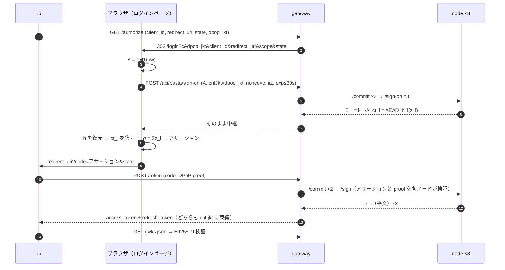

# decentralized_idp

パスワードを誰にも見せずにログインし、単独では誰もトークンを発行できない OAuth 2.0 認可サーバー。PASTA（閾値 OPRF）と FROST（閾値 Ed25519 署名）を組み合わせ、n 台のアイデンティティノードのうち t 台が協力したときだけ署名が成立する。RP（relying party）から見えるのは普通の OAuth 認可コードフロー + DPoP。

```
ブラウザ ──→ rp ──→ gateway ──→ node1 / node2 / node3
```

- **ブラウザ**でパスワードはブラインドされ、ノードが返す暗号化された署名シェアを復号・合成して**認証アサーション**（= 認可コード）を組み立てる。復号できるのはパスワードを知る者だけ
- **gateway** は状態を一切持たない OAuth サーバー。ノードへの中継とシェアの合成だけを行い、シェアの復号も単独署名もできない
- **node** はグループ署名鍵のシェア `s_i` とユーザーごとの TOPRF シェア `k_i` を持つ。パスワードもトークンも見ない
- **rp** は DPoP 鍵を持ち、認可コードをその鍵に束縛されたアクセストークンに交換する

読者は FROST、TOPRF、OAuth 2.0、DPoP の基本を知っているものとする。

## 構成

| ディレクトリ | 役割 |
|---|---|
| [`projects/protocol`](projects/protocol) | 規範。ノード API の JSON Schema、テストベクタ、符号化・時間・トークンの規則。コードなし |
| [`projects/sdk`](projects/sdk) | protocol の TypeScript 実装（`@decentralized-idp/sdk`）。全コンポーネントが使う |
| [`projects/distKey`](projects/distKey) | 起動前に一度だけ走る trusted dealer。鍵を分割して `secrets/` に書く |
| [`projects/node`](projects/node) | アイデンティティノード。`/commit` `/sign-on` `/sign` |
| [`projects/gateway`](projects/gateway) | OAuth 認可サーバー。`/authorize` `/token` `/jwks.json` とログインページの配信 |
| [`projects/idpFront`](projects/idpFront) | ログインページ（gateway が配信）と、ブラウザ役の CLI |
| [`projects/rp`](projects/rp) | relying party の最小実装 |
| [`projects/e2e`](projects/e2e) | compose で上げたコンテナ群を、ホストの Chromium で rp からリフレッシュまで通すテスト |
| [`docs/requirements`](docs/requirements) | コーディング方針と QA プロセス |
| [`scripts`](scripts) | 統合テストと tmux デモ表示 |

npm workspaces。`npm ci` はリポジトリルートで一度。各プロジェクトは `npm run qa-gate`（型チェック + ビルド + カバレッジ付きテスト）を持ち、ルートの `npm run qa-gate` が全部を回す。e2e は Docker と Chromium を要する。Chromium は `npm run browser:install --prefix projects/e2e` で一度だけ入れる。

## 動かす

```bash
docker compose up --build --wait      # distKey → node×3 → gateway（+ログインページ）→ rp
open http://localhost:3001            # rp の「Sign in」から。alice / password123、bob / password456
```

ターミナルだけで試すなら、ブラウザ役の CLI がアクセストークンを出力する:

```bash
npm ci && npm run build --prefix projects/sdk
npx tsx projects/idpFront/cli.ts --gateway http://localhost:3000 --user alice --password password123 --refresh
```

各コンポーネントが何を持ち何を持たないかは、それぞれの標準出力に1〜2行のトレースとして出る。`scripts/demo-tmux.sh` が5コンポーネント + CLI を並べて表示する。

```bash
scripts/integration-test.sh           # compose を上げ、外側から一通り確認する
```

鍵を作り直すときは `docker compose down && rm -rf secrets` の後に `up`。`secrets/` は gitignore 済み。

## 流れ



- アサーションは 30 秒だけ有効。リプレイで得られるトークンも同じ DPoP 鍵に束縛されるので、鍵を持たない者には使えない
- リフレッシュトークンもノードのグループ署名付き JWT。gateway はどのトークンも保持しない
- ノードが 1 台落ちても t=2 で続く。2 台落ちると `quorum 1 < 2` で拒否される

## 開発

```bash
npm ci
npm run browser:install --prefix projects/e2e   # e2e が使う Chromium。一度だけ
npm run qa-gate                       # 全ワークスペース
docker build -f projects/node/Dockerfile .   # 各 Dockerfile はリポジトリルートをコンテキストにする
```

コードの書き方は [`docs/requirements/code_philosophy.md`](docs/requirements/code_philosophy.md)、確認の手順は [`docs/requirements/qa_process.md`](docs/requirements/qa_process.md)。

ユーザー登録はまだ distKey の事前登録のみ（動的な登録 API はない）。DKG も対象外で、鍵配布は trusted dealer による。
