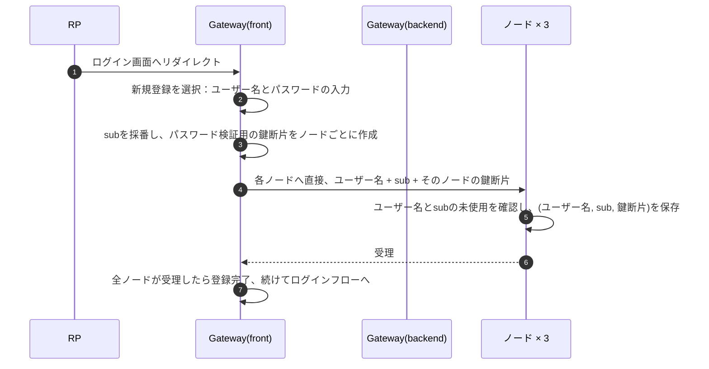
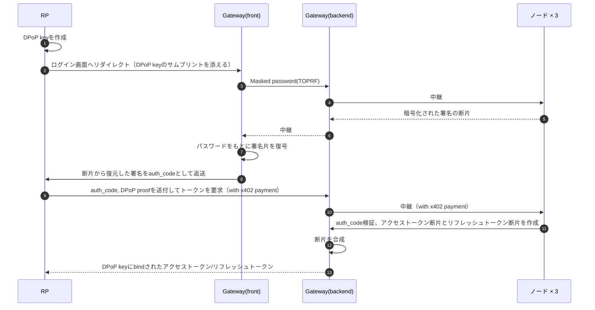
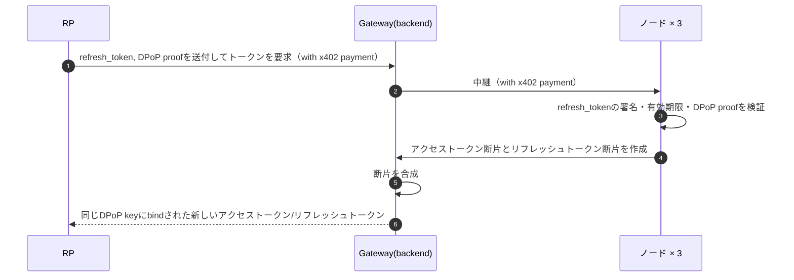
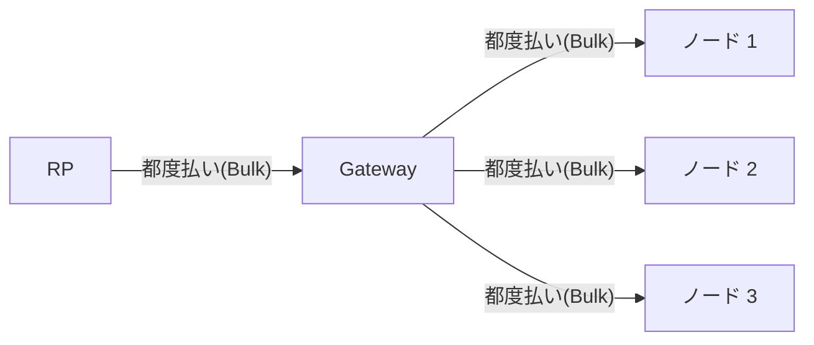

# 分散型 IdP ホワイトペーパー

## Abstract

現在ではGoogleやLINE等による大手プラットフォームが展開するIdentity Provider(IdP)が普及しており、ユーザーは既存のIDを使うことでサインアップを省略して素早くサービスにアクセスでき、サードパーティサービス(RP)は自前でID関連の情報を持つリスクを回避するとともに開発を簡素化できるようになっている。
これらは多くの場合無料で提供されており高い利便性と経済合理性を提供している一方で、IdP事業者が以下のような強力な権限を保有することが避けられない。

1. 任意のユーザーの、任意のサービスのアクセストークンを自由に発行できる
2. ユーザーがどのようなサービスにいつアクセスしたのかを把握できる
3. IdPやそれが属する国のルールによって特定のユーザーを排除できる

これらの課題において特に1点目は重大なセキュリティリスクであり、例えば金融サービスのアカウント管理を特定IdPに移譲しているなら実質的に資産を管理しているのはそのIdPとなる。
大手IdPの普及が進んでますます多数のRPがそれに依存するようになれば、IdPに対してユーザーやRP、ひいてはそれらが属する国は弱い立場に置かれてしまう。
そのような集権化を防ぐことを目的として、ここでは分散型のIdPを構築するソフトウェアキットを提供する。
具体的には、複数のノードによってのみ認証/アクセストークン発行が行われるようにし、処理を完遂できる単一のサーバーを存在させない。
また本プロジェクトにおいてはもう一つの重要な要素として、既存のOAuthプロトコルと完全互換であることを保証する。
これは分散型のIDとして似た取り組みにDecentralized ID(DID)がすでに存在するが、既存プロトコルとの乖離が普及を見送らせていることを教訓としている。

分散型であるとは利害の一致しない主体が集まってシステムを共同運営することであり、そうした主体を協調させるのはインセンティブ設計の他にない。
本プロジェクトでは法に基づいた書面や後日送られる請求書によって主体の活動を規定するのではなく、x402プロトコルに基づいた機械的な支払いのみをもってインセンティブを設計する。
大手IdPが無料で提供されているのは慈善事業ではなくユーザーデータの収集/広告収益が目的と思われるが、意図せぬ個人情報利用、さらには広告による行動制御はユーザーにとっての不利益である。
そのような方法に頼らず、RPからシステム利用料の形で費用を補填することが健全であると考える。

## 1. 既存のソリューション

OAuthの活用形には、「Googleでログイン」のようにパブリックに利用できるソーシャルログインと、企業が導入するAuth0のようなIDaaSの2種類が考えられる。
ソーシャルログインは誰でもアカウントが作れて登録さえすればRPも自由に参加できる一方、IDaaSは企業が自社社員のためのID空間を用意するような形で使われることが多い。
前者は無料（理由は前述の通り）、後者は企業がIDaaSプロバイダに費用を支払う形で導入される。
機能としてはどちらもIdPではあるが、会社等の組織がID空間を用意したい際に、認証手段のカスタムや契約による責任分解ができる点で前提が異なる。
本IdPの特徴も加えた一覧は以下の通り。

|            | ソーシャルログイン   | IDaaS            | 本IdP             |
| ---------- | -------------------- | ---------------- | ----------------- |
| 認証手段   | IdPによる規定手法    | カスタム可能     | IdPによる規定手法 |
| 主体の関係 | 利便性+個人情報収集  | 契約による定義   | 利便性+即時決済   |
| 支払い者   | ユーザー（個人情報） | 導入企業（金銭） | RP（金銭）        |
| IdPの権限  | すべて               | すべて           | 閲覧のみ          |

前述の通り本IdPはソーシャルログインに対する問題意識から考案されており、IDaaSとは様々な点で前提が異なる。
特にノードの分散に関して、IDaaSが導入されるようなケースでは企業統制が重視されていることから自由度を確保しづらく、さらに契約による保証が含まれていることからその重要度も低い。
以降の設計において既存サービスと比較する際には、ソーシャルログインを念頭において検討する。

さらに類似のサービスとしてはWalletconnectが挙げられる。
これはOAuthとは関係のない独自の手法によるものだが、サードパーティサービスがウォレットによる認証を統合するための仕組みを提供しており、これはソーシャルログインが与える利便性に近い。

|              | Walletconnect               | 本IdP             |
| ------------ | --------------------------- | ----------------- |
| 認証手段     | ウォレットによる署名        | IdPによる規定手法 |
| 主体の関係   | 利便性+特定サービスへの誘導 | 利便性+即時決済   |
| 支払い者     | 別サービスの収益            | RP                |
| 運営者の権限 | 中継のみ、閲覧不可          | 閲覧のみ          |
| プロトコル   | 独自プロトコル              | OAuth準拠         |

両者は運営者の権限が小さいというところで似ており、特にWalletconnectは閲覧できる情報も最小化する工夫がなされている。
明確な違いはOAuth準拠かどうかという点で、これにより対応サービス領域が大きく離れる。
本IdPの方向性を考える上で、Walletconnectも認証機能自体で費用を取ることは難しいと認めている点は影響が大きい。

TODO: RPがなぜ支払うのかというインセンティブモデルは課題として残される。
ログインを提供することで特定の収益サービスへの動線にするというアイディアについては要検討。

## 2. 認証フローの全容

ユーザーがログインを完遂するためのフローと登場するコンポーネントは以下の通り。

| コンポーネント | 役割                                                     | 持つもの                                 |
| -------------- | -------------------------------------------------------- | ---------------------------------------- |
| RP             | サードパーティサービス。ログインを本IdPに任せる          | DPoP鍵、クライアント認証鍵、x402用アカウント |
| Gateway        | ログイン画面フロント + サインオンでのフロントとノード間の中継API | x402用アカウント                         |
| ノード × 3     | トークンに署名する鍵の断片、パスワードを検証する鍵の断片 | 鍵断片、ユーザーの一覧、x402用アカウント |

**登録フロー**

**ログインフロー**

**アクセストークンのリフレッシュフロー**

RPは従来のIdPと連携するかのように、本IdPのログインボタンを配置する。
ユーザーはそれをタップすると、Gatewayのページに遷移してそこでパスワードを入力する。
その後はブラウザがRPへと遷移してログインが完了となり、従来のOAuthと全く同じ体感で使用できる。
またリフレッシュに関してもOAuthと同様、RPがユーザーの操作を介さずIdPと通信して完結できるようになっている。
従来と異なるのは内部処理で、パスワードはハッシュの称号ではなくTOPRFによる秘密値の導出で行われ、アクセストークン発行は閾値署名で行われる。
この際、通信のハブとなっているGatewayは与えられた情報の中継と断片の合成しかできず、Gatewayのみの意思ではアクセストークンを勝手に発行することは不可能になっている。
RPが受け取るのは合成済みのトークンであり、RPは断片やその合成を知らない通常のOAuthクライアントでよい。
またノード単体の意思でも同様にアクセストークンは生成できないようになっている。

ただしGatewayには一つ注意点があり、ログイン画面として配信しているjsファイルを改竄されるとパスワードを取得されるおそれがある。
これは暗号方式の選定によって防げるものではなく、Webページとして展開されるパスワードログイン全般に共通する前提である。
本IdPが従来と異なるのはその先で、従来のIdPは運営者が任意の時点で黙って任意のユーザーのトークンを作れるが、本IdPにおいてはユーザーが侵害後にログイン操作をしないと介入できない。
また鍵断片やTOPRF情報が漏れただけでは攻撃者は何もできない。

仮に今後パスキーを導入すると、Gatewayの侵害で起きることはさらに縮まる。
操作中のユーザーの1セッション分のトークンを横取りすること、および登録時にノードへ届く公開鍵をすり替えることのみが攻撃者に許される。
前者は継続的な侵害と実際のユーザー操作を要し、後者は永続的だが侵害中に登録したユーザーに限られる。
パスキーの導入は各ノードでWebAuthnの署名を検証するだけで済むため、優先すべき拡張と思われる。

## 3. エコノミクス

RP、Gateway、NodeはUSDCを持つウォレットを用意しておき、x402による支払いを行う。
前述のフローにおいて、RPはGateway上のエンドポイントを叩いてアクセストークンを取得する際に支払いを行う。
また、GatewayはTOPRFや署名片取得のためのNode上のエンドポイントを叩く際に支払いを行う。
これらの支払いには専用のエンドポイントは設けられず、認証の仕組み上必要なエンドポイントにおいて402を返却し、支払いによって通常通り利用可能にするという方式を採る。
RPの実装としては、HTTPクライアントにプラグインを入れるだけで対応可能と思われる。
シンプルに都度払いにするとガス代とレイテンシが増大するため、バルク支払いを採用する。
GatewayはRPのクレジットが尽きたときだけ402を返し、まとまった回数分を前払いさせる。Gatewayからノードへの支払いも同様。
x402におけるFacilitatorについてはGatewayの実装に任されるが、本リポジトリの実装では自らブロックチェーンにアクセスしてFacilitator役も兼ねるものとする。

具体的な料金について、以下のように定める。
Nodeは3台あるので、1件のアクセストークン発行についてGatewayに残るのは0.001USDCということになる。

- (RP -> Gateway)トークンの取得：0.01USDC
- (Gateway -> Node)トークン署名片取得：0.003USDC

## 4. 脅威モデル

本IdPが対応する脅威と対応しないものを以下に示す。
大手ソーシャルログインに対する課題意識から発足した本IdPであるが、現状では全てを解決せず、まずは単一の運営者の侵害に対する耐性を獲得している。

| 脅威                                                  | 扱い                                                                                 |
| ----------------------------------------------------- | ------------------------------------------------------------------------------------ |
| ノード運営者一者の侵害、内部犯                        | 正常稼働を継続。パスワードもトークン発行能力も漏れない                               |
| ノード運営者二者の結託                                | 動作み定義。トークンの偽造とパスワードへの辞書攻撃ができる。運営主体を分けて抑止する |
| Gateway, ノードが「alice が今ログインした」と知ること | 現状防がない。対策を要検討                                                           |
| Gateway, ノードがどのサービスへのログインかを知ること | 現状防がない。対策を要検討                                                           |
| RP 同士が結託してユーザーを突合すること               | 対象外。IdP運営者の不正とは別の課題                                                  |
| なりすましRP　                                        | 現状個人情報を扱っておらず、なりすまされても被害がないため保留。                     |
| Gateway backendの侵害、内部犯                         | 閲覧のみ。トークンの偽造もパスワードの取得もできない                                 |
| Gateway front改竄                                     | 侵害中に登録 or ログインを行ったユーザーの恒久乗っ取り                               |
| Gateway front改竄（パスキー導入時）                   | 操作中のユーザーの1セッション分の横取りと、侵害中に登録したユーザーの恒久乗っ取り    |
