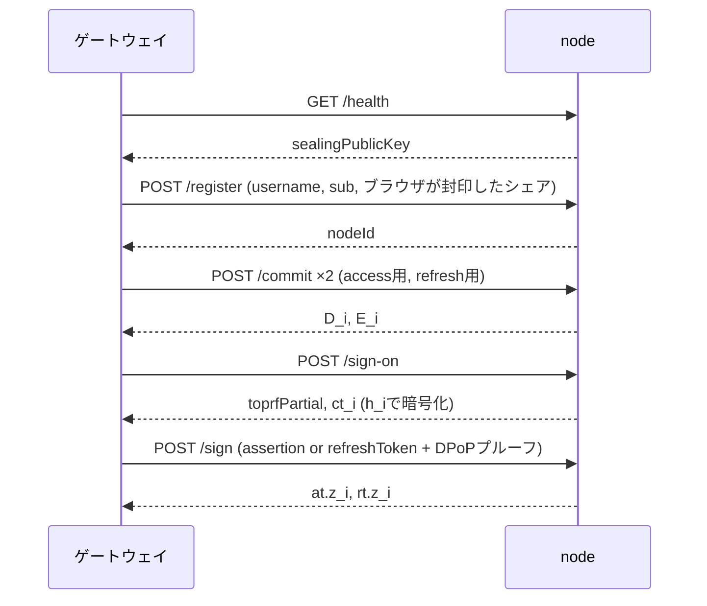

# node

n台あるアイデンティティノードの1台。グループEd25519鍵のFROSTシェア `s_i` と封印用のX25519鍵を持ち、`/register` で受け取ったユーザーごとにTOPRFシェア `k_i` と、そこから導かれる鍵 `h_i` を持つ。パスワードも、組み立て済みのトークンも見ない。セッション状態は持たず、保持するのは開いたままのFROSTラウンドのナンス（`(d_i, e_i)`）だけである。

読者はFROST（閾値Ed25519署名）とTOPRF（閾値OPRF）の基本を知っているものとする。

署名シェア `z_i` の返し方は2通りある。`/sign-on` ではパスワードを知る者だけが復号できるよう `h_i` で暗号化して返す（これが認証そのもの）。`/sign` ではアサーションとDPoPプルーフの検証が済んでいるので平文で返し、ゲートウェイが合成する。

## ディレクトリ構成

[`../sdk`](../sdk)（`@decentralized-idp/sdk`）はプロトコルのTypeScript実装で、サンプル各コンポーネントが共有する。FROST・TOPRF・Shamir・AEAD・DPoPといった計算、3種のJWTのレイアウト、そしてこのノードのHTTP APIのスキーマ（`node-api`）がそこにあり、ここでは使うだけ。

- `domain/value`: 複数の層から使う値（`NodeIdentity`: `s_i`・グループ公開鍵・封印用秘密鍵など）。1箇所でしか使わない型はその使用箇所の直上に定義する
- `domain/entity`: `UserRepository`が管理するユーザーレコード（`User`）の定義
- `domain/repository`: エンティティ管理のインターフェース（`UserRepository`）と、登録済みのユーザー名を表す `UsernameTakenError`
- `domain/infra`: repository以外の外部接続のインターフェース（`Clock`, `RoundStore`）
- `domain/service/credential.ts`: `/sign` に提示されたクレデンシャルの検証規則（寿命・鮮度・`typ`・`iss`/`aud`）。3種のJWTのレイアウトは gateway と共有するため `@decentralized-idp/sdk/tokens` にある
- `domain/usecase`: domainの外に提供する機能
  - `register`: 自ノード宛てに封印されたシェアを開き、ユーザーとして保存する
  - `commit`: FROSTラウンド1。ナンスを生成してラウンドを開き、自ノードのコミットメントを返す
  - `signOn`: FROSTラウンド2（認証アサーション用）。TOPRFを評価し、アサーションに署名し、シェアを`h_i`で暗号化して返す
  - `issueTokens`: FROSTラウンド2（アクセストークン・リフレッシュトークン用）。アサーションまたはリフレッシュトークンとDPoPプルーフを検証し、2つの署名シェアを返す
- `infra/node.ts`: ノードの組み立て。dealer の設定ファイルの読み込み、`RoundStore`・`Clock` のインプロセス実装、それらを差し込んだ `IdentityNode` の生成
- `infra/user-store.ts`: `UserRepository` の実装 `FileUserRepository`。`USERS_FILE` を起動時に読み、登録のたびに書き直す
- `http`: [Hono](https://hono.dev) + `@hono/node-server` によるHTTP層
  - `endpoint/{health,register,commit,sign-on,sign}.ts`: エンドポイント1本につき1ファイル。検証済みボディを受けて usecase を呼び、応答を `@decentralized-idp/sdk/node-api` のスキーマで `z.encode` し、デモログの行を組む
  - `server.ts`: Honoアプリの組み立て。メソッドとパスをここに並べ、各endpointを接続する
  - `validate.ts`: 検証失敗を `400 { error }` にするフックと不正JSONの拒否。リクエスト・応答の [Zod](https://zod.dev) スキーマ自体は `@decentralized-idp/sdk/node-api` にあり、`server.ts` が `@hono/zod-validator` で各エンドポイントに接続する
  - `answer.ts`: usecase の拒否を `{ error }` にする `answer`。`UsernameTakenError` は409、それ以外は400
  - `demo-log.ts`: デモトレースの行出力器。文面は各endpointが組む

### 依存の向き

import は常に下へ向かう。`tests/dependencies.test.ts` がこの表を検査する。`@decentralized-idp/sdk` はどの層からも使う。

```
main                      → http, infra
http (server, answer)     → http/endpoint, http (validate, demo-log), domain/usecase, domain/repository
http/endpoint             → http (validate, demo-log), domain/usecase
infra                     → domain/usecase, domain/entity, domain/repository, domain/infra, domain/value
domain/usecase            → domain/service, domain/repository, domain/infra, domain/value
domain/service            → domain/value
domain/repository         → domain/entity
http (validate, demo-log), domain/entity, domain/infra, domain/value → なし
```

変更の影響範囲は、そのファイルを import している上の層だけである。

## 実行

```bash
npm ci --prefix ../..            # ワークスペース全体を一度に入れる
npm run build --prefix ../sdk
npm run dev    # tsxでsrc/main.tsを直接実行
npm start      # npm run buildでdist/を作った後
```

### 環境変数

| 変数 | デフォルト | 意味 |
|---|---|---|
| `NODE_CONFIG` | `/secrets/node.json` | ディーラーが書き出す`node-<id>.json`のパス |
| `USERS_FILE` | `/data/users.json` | 登録済みユーザーの保存先。なければユーザー0人で起動し、最初の登録で作る |
| `PORT` | `4000` | listenポート |
| `ISSUER` | `http://localhost:3000` | ブラウザから見たゲートウェイのURL。`iss`として署名し、`/token`宛のDPoPプルーフの`htu`として要求する |
| `DEMO_LOG` | 有効 | `0`でデモトレースを止める |
| `FORCE_COLOR` | 未設定 | 設定されていれば `0` 以外で有色。未設定ならTTY判定に従う |

### 設定ファイル

`NODE_CONFIG`が指すJSONはディーラーが書き出すversion 2の形。バイト列とスカラーはすべて小文字hex、スカラーは64桁固定でビッグエンディアン（署名計算内部のリトルエンディアン表現とは向きが逆なので注意）。`sealingSecretKey` がない、または32バイトでないファイルは起動時に拒否する。

```json
{
  "version": 2, "nodeId": 1, "threshold": 2, "total": 3,
  "groupPublicKey": "<hex 64桁>", "secretKeyShare": "<hex 64桁>",
  "sealingSecretKey": "<hex 64桁: X25519 秘密鍵>"
}
```

### ユーザーファイル

`USERS_FILE` は `/register` で受け取ったユーザーを保持する。登録のたびに全体を `<path>.tmp` に書いてから rename する。コンテナでは `/data` をボリュームにして再起動をまたいで残す。

```json
{
  "version": 1,
  "users": [
    { "username": "alice", "sub": "...", "h_i": "<hex 64桁>",
      "toprfKeyShare": { "id": 1, "value": "<hex 64桁>" } }
  ]
}
```

## HTTP API

規範は [`../protocol/README.md`](../protocol/README.md) の「ノード HTTP API」。エンドポイント、ボディの形、エラー応答の規則はそこにあり、このノードはそのスキーマ（`@decentralized-idp/sdk/node-api`）をそのまま使う。



## 検証内容

`/sign-on`と`/sign`で拒否されるのは以下の場合。

- 有効期間: アサーションは最大30秒、アクセストークンは最大3600秒、リフレッシュトークンは30日固定
- `iat`は現在時刻から±60秒以内
- DPoPプルーフ（`/sign`のみ）: `htm`が`POST`、`htu`が`<ISSUER>/token`、`jkt`が対象クレデンシャルの`cnf.jkt`と一致すること
- JWTの`typ`（アサーションは`JWT`、アクセストークンは`at+jwt`、リフレッシュトークンは`refresh+jwt`）
- 提示されたクレデンシャルの`iss`/`aud`がこのノードの`issuer`と一致すること

リプレイは意図的に追跡しない。トークンはDPoPでクライアント鍵に束縛されており、同じクレデンシャルとDPoPプルーフの再送は同じトークンを再発行するだけで、追跡してもリスクが変わらないため。

## デモログ

`DEMO_LOG`が有効なとき、標準出力に1〜2行のトレースを出す。ワイヤに乗った値のみを先頭8文字に切って出し、`s_i`・`k_i`・`h_i`・パスワードは一切出さない。

```
[node1]   ● up      id=1 t=2/3   holds: s_1, and k_1, h_1 per registered user   never: pw, h, other s_i/k_i, sessions, access tokens
[node1]   register  user=alice sub=usr_alice_12345  ← sealed share (opened here) → stored
[node1]   commit    round=8f3a2b1c  → D_1,E_1 4f2a91cd 9b31aa02
[node1]   sign-on   round=8f3a2b1c user=alice  ← A 5e6f7a8b  (D,E)×3  nonce_s c1d2e3f4  jkt 1a2b3c4d
                    → B_1=k_1·A 7f8e9d0c  ct_1=AEAD_h1(z_1) 2b3c4d5e
[node1]   sign      round=8f3a2b1c grant=authz  ← assertion σ 9a8b7c6d ✓  DPoP ✓ jti f1e2d3c4  (D,E)×3  → at z_1 6d5c4b3a + rt(refresh+jwt) z_1 3a4b5c6d
[node1]   ✖ sign-on rejected: User not found on node 1
```

## 開発

```bash
npm test          # ../sdk をビルドしてから vitest
npm run typecheck
npm run qa-gate    # typecheck + build + テスト
```

```bash
# リポジトリルートで
docker build -f projects/node/Dockerfile -t idp-node .
docker run --rm -e NODE_CONFIG=/secrets/node-1.json -e PORT=4001 \
  -v "$(pwd)/projects/node/tests/fixtures:/secrets:ro" -p 4001:4001 idp-node
```
