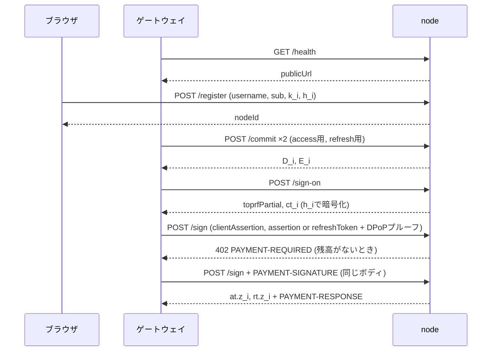

# node

n台あるアイデンティティノードの1台。グループEd25519鍵のFROSTシェア `s_i` を持ち、ブラウザから `/register` で直接受け取ったユーザーごとにTOPRFシェア `k_i` と、そこから導かれる鍵 `h_i` を持つ。パスワードも、組み立て済みのトークンも見ない。セッション状態は持たず、保持するのは開いたままのFROSTラウンドのナンス（`(d_i, e_i)`）と、ゲートウェイごとの `/sign` の前払い残高だけである。

読者はFROST（閾値Ed25519署名）とTOPRF（閾値OPRF）の基本を知っているものとする。

署名シェア `z_i` の返し方は2通りある。`/sign-on` ではパスワードを知る者だけが復号できるよう `h_i` で暗号化して返す（これが認証そのもの）。`/sign` ではアサーションとDPoPプルーフの検証が済んでいるので平文で返し、ゲートウェイが合成する。

## ディレクトリ構成

[`../sdk`](../sdk)（`@decentralized-idp/sdk`）はプロトコルのTypeScript実装で、サンプル各コンポーネントが共有する。FROST・TOPRF・Shamir・AEAD・DPoPといった計算、3種のJWTのレイアウト、そしてこのノードのHTTP APIのスキーマ（`node-api`）がそこにあり、ここでは使うだけ。

- `domain/value`: 複数の層から使う値（`NodeIdentity`: `s_i`・グループ公開鍵・自ノードの公開URLなど、`Gateway`: `/sign` を呼べるゲートウェイの `client_id` と公開鍵）。1箇所でしか使わない型はその使用箇所の直上に定義する
- `domain/entity`: `UserRepository`が管理するユーザーレコード（`User`）の定義
- `domain/repository`: エンティティ管理のインターフェース（`UserRepository`）と、登録済みのユーザー名または `sub` を表す `AlreadyRegisteredError`
- `domain/infra`: repository以外の外部接続のインターフェース（`Clock`, `RoundStore`）
- `domain/service/credential.ts`: `/sign` に提示されたクレデンシャルの検証規則（寿命・鮮度・`typ`・`iss`/`aud`）。3種のJWTのレイアウトは gateway と共有するため `@decentralized-idp/sdk/tokens` にある
- `domain/usecase`: domainの外に提供する機能
  - `register`: ブラウザから届いた自ノード向けのシェア `k_i`・`h_i` を、ユーザーとして保存する
  - `commit`: FROSTラウンド1。ナンスを生成してラウンドを開き、自ノードのコミットメントを返す
  - `signOn`: FROSTラウンド2（認証アサーション用）。TOPRFを評価し、アサーションに署名し、シェアを`h_i`で暗号化して返す
  - `issueTokens`: FROSTラウンド2（アクセストークン・リフレッシュトークン用）。アサーションまたはリフレッシュトークンとDPoPプルーフを検証し、2つの署名シェアを返す
  - `authenticateCaller`: `/sign` の `clientAssertion`（ゲートウェイの `private_key_jwt`）を検証し、課金先の `client_id` を返す
  - `IdentityNode`: use case が受け取るノード全体。支払いまわり（`Billing`: ゲートウェイ一覧・価格・残高・決済）もここにある
- `infra/node.ts`: ノードの組み立て。dealer の設定ファイルの読み込み、`RoundStore`・`Clock` のインプロセス実装、それらを差し込んだ `IdentityNode` の生成
- `infra/user-store.ts`: `UserRepository` の実装 `FileUserRepository`。`USERS_FILE` を起動時に読み、登録のたびに書き直す
- `infra/credit-store.ts`: sdk の `CreditStore` の実装 `FileCreditStore`。`CREDITS_FILE` を起動時に読み、残高が変わるたびに書き直す
- `infra/gateways.ts`: `GATEWAYS_CONFIG` の読み込み
- `http`: [Hono](https://hono.dev) + `@hono/node-server` によるHTTP層
  - `endpoint/{health,register,commit,sign-on,sign}.ts`: エンドポイント1本につき1ファイル。検証済みボディを受けて usecase を呼び、応答を `@decentralized-idp/sdk/node-api` のスキーマで `z.encode` し、デモログの行を組む
  - `server.ts`: Honoアプリの組み立て。メソッドとパスをここに並べ、各endpointを接続する。ログイン画面はゲートウェイが issuer のオリジンで配信し、そこから `/register` を直接呼ぶため、`/register` だけに issuer オリジンからの CORS を許可する
  - `validate.ts`: 検証失敗を `400 { error }` にするフックと不正JSONの拒否。リクエスト・応答の [Zod](https://zod.dev) スキーマ自体は `@decentralized-idp/sdk/node-api` にあり、`server.ts` が `@hono/zod-validator` で各エンドポイントに接続する
  - `endpoint/sign.ts`: 呼び出し元の認証、x402 による受け入れ（402）、署名、成功時の課金の順に行う
  - `answer.ts`: usecase の拒否を `{ error }` にする `answer`。`AlreadyRegisteredError`（`username` か `sub` が登録済み）は409、それ以外は400。endpoint が自分で組んだ応答（`/sign` の402）はそのまま返す
  - `demo-log.ts`: デモトレースの行出力器。文面は各endpointが組む

### 依存の向き

import は常に下へ向かう。`tests/dependencies.test.ts` がこの表を検査する。`@decentralized-idp/sdk` はどの層からも使う。

```
main                      → http, infra
http (server, answer)     → http/endpoint, http (validate, demo-log), domain/usecase, domain/repository
http/endpoint             → http (validate, demo-log), domain/usecase
infra                     → domain/usecase, domain/entity, domain/repository, domain/infra, domain/value
domain/usecase            → domain/service, domain/repository, domain/infra, domain/value
domain/service            → domain/value
domain/repository         → domain/entity
http (validate, demo-log), domain/entity, domain/infra, domain/value → なし
```

変更の影響範囲は、そのファイルを import している上の層だけである。

## 実行

```bash
npm ci --prefix ../..            # ワークスペース全体を一度に入れる
npm run build --prefix ../sdk
npm run dev    # tsxでsrc/main.tsを直接実行
npm start      # npm run buildでdist/を作った後
```

### 環境変数

| 変数 | デフォルト | 意味 |
|---|---|---|
| `NODE_CONFIG` | `/secrets/node.json` | ディーラーが書き出す`node-<id>.json`のパス |
| `NODE_CONFIG_JSON` | なし | 同じファイルの中身。Secret が環境変数でしか渡せない環境向け。あればパスより優先 |
| `USERS_FILE` | `/data/users.json` | 登録済みユーザーの保存先。なければユーザー0人で起動し、最初の登録で作る |
| `PORT` | `4000` | listenポート |
| `ISSUER` | `http://localhost:3000` | ブラウザから見たゲートウェイのURL。`iss`として署名し、`/token`宛のDPoPプルーフの`htu`として要求する。`/register` の CORS で許可するオリジンでもある |
| `PUBLIC_URL` | `http://localhost:<PORT>` | ブラウザから見たこのノードのURL。`/health` で返し、ゲートウェイがログイン画面に登録先として伝える。ゲートウェイの `clientAssertion` の `aud` でもある。ノードごとに異なるので、コンテナでは compose が設定する |
| `GATEWAYS_CONFIG` | `/secrets/gateways.json` | `/sign` を呼べるゲートウェイの一覧（[ゲートウェイファイル](#ゲートウェイファイル)） |
| `GATEWAYS_JSON` | なし | 同じファイルの中身。あればパスより優先 |
| `NETWORK` | `eip155:84532` | 支払いを受けるチェーン（CAIP-2）。`eip155:84532`（Base Sepolia）か `eip155:8453`（Base） |
| `RPC_URL` | `https://sepolia.base.org` | そのチェーンの JSON-RPC。決済の送信と確認に使う |
| `PRICE_SIGN` | `3000` | `/sign` 1回の価格。USDC の最小単位（10⁻⁶）で、3000 は 0.003 USDC |
| `CREDIT_BATCH` | `100` | 1回の支払いで買う `/sign` の回数 |
| `CREDITS_FILE` | `/data/credits.json` | ゲートウェイごとの残高の保存先。なければ残高0で起動し、最初の支払いで作る |
| `DEMO_LOG` | 有効 | `0`でデモトレースを止める |
| `FORCE_COLOR` | 未設定 | 設定されていれば `0` 以外で有色。未設定ならTTY判定に従う |

### 設定ファイル

`NODE_CONFIG`が指すJSONはディーラーが書き出すversion 3の形。バイト列とスカラーはすべて小文字hex、スカラーは64桁固定でビッグエンディアン（署名計算内部のリトルエンディアン表現とは向きが逆なので注意）。`wallet` は支払いを受け取り、決済のガスを払う EVM アカウントで、なければ起動しない。

```json
{
  "version": 3, "nodeId": 1, "threshold": 2, "total": 3,
  "groupPublicKey": "<hex 64桁>", "secretKeyShare": "<hex 64桁>",
  "wallet": { "address": "0x<40桁>", "privateKey": "0x<64桁>" }
}
```

### ゲートウェイファイル

`GATEWAYS_CONFIG` はディーラーが書き出す、`/sign` を呼べるゲートウェイの一覧。形はゲートウェイの `clients.json` と同じで、各ゲートウェイの JWKS の最初の Ed25519 鍵（`x` が32バイト）を使う。

```json
{ "version": 1, "clients": [ { "client_id": "gateway", "jwks": { "keys": [ { "kty": "OKP", "crv": "Ed25519", "x": "<base64url>" } ] } } ] }
```

### 残高ファイル

`CREDITS_FILE` はゲートウェイごとの残り回数。変わるたびに全体を `<path>.tmp` に書いてから rename する。

```json
{ "version": 1, "credits": { "gateway": 99 } }
```

### ユーザーファイル

`USERS_FILE` は `/register` で受け取ったユーザーを保持する。`username` と `sub` はそれぞれ一意で、どちらかが既存の登録と重なれば409で拒否する。登録のたびに全体を `<path>.tmp` に書いてから rename する。コンテナでは `/data` をボリュームにして再起動をまたいで残す。

```json
{
  "version": 1,
  "users": [
    { "username": "alice", "sub": "...", "h_i": "<hex 64桁>",
      "toprfKeyShare": { "id": 1, "value": "<hex 64桁>" } }
  ]
}
```

## HTTP API

規範は [`../protocol/README.md`](../protocol/README.md) の「ノード HTTP API」。エンドポイント、ボディの形、エラー応答の規則はそこにあり、このノードはそのスキーマ（`@decentralized-idp/sdk/node-api`）をそのまま使う。

| メソッド | パス | 呼び出し元 | 内容 |
|---|---|---|---|
| GET | `/health` | ゲートウェイ | `nodeId`・グループ公開鍵・`publicUrl` |
| POST | `/register` | ブラウザ（直接、CORS） | `username`・`sub`・`k_i`・`h_i` を保存する。`username` か `sub` が登録済みなら409 |
| POST | `/commit` | ゲートウェイ | FROSTラウンド1 |
| POST | `/sign-on` | ゲートウェイ | TOPRF評価と認証アサーションへのFROSTラウンド2 |
| POST | `/sign` | ゲートウェイ | アクセストークンとリフレッシュトークンへのFROSTラウンド2。有料（[支払い](#支払い)）。残高がなければ402 |



## 支払い

`/sign` はゲートウェイへの有料サービスで、x402 v2（`exact` スキーム、USDC）の前払い残高で売る。規則は [`../protocol/README.md`](../protocol/README.md) の「支払い」、実装は `@decentralized-idp/sdk/x402` にある。

- 課金先は `clientAssertion` が示すゲートウェイ。`clientAssertion` が通らなければ残高を見る前に400
- 残高があれば処理し、署名できたときだけ1減らす。拒否（400）された要求は無料
- 残高がなければ402を返し、`PAYMENT-REQUIRED` ヘッダで `PRICE_SIGN × CREDIT_BATCH` を `wallet.address` 宛てに求める。ゲートウェイは同じ要求に `PAYMENT-SIGNATURE` を添えて再送する。402もラウンドのナンスを消費しないので、同じラウンドのまま再送できる
- ノードは自分自身がファシリテーター。支払いの署名を検証し、`transferWithAuthorization` を自分でチェーンに送る。そのガスは `wallet` が払うので、`wallet` には `NETWORK` のガス代（ETH）が要る
- 決済できれば残高に `CREDIT_BATCH` 回を足して要求を処理し、決済の記録を `PAYMENT-RESPONSE` ヘッダで返す。決済に失敗すれば402のまま（`settlement failed: …`）

## 検証内容

`/sign-on`と`/sign`で拒否されるのは以下の場合。

- 有効期間: アサーションは最大30秒、アクセストークンは最大3600秒、リフレッシュトークンは30日固定
- `iat`は現在時刻から±60秒以内
- DPoPプルーフ（`/sign`のみ）: `htm`が`POST`、`htu`が`<ISSUER>/token`、`jkt`が対象クレデンシャルの`cnf.jkt`と一致すること
- JWTの`typ`（アサーションは`JWT`、アクセストークンは`at+jwt`、リフレッシュトークンは`refresh+jwt`）
- `clientAssertion`（`/sign`のみ、最初に検証する）: `GATEWAYS_CONFIG` にあるゲートウェイの鍵で署名され、`iss` = `sub` = その `client_id`、`aud` にこのノードの `PUBLIC_URL` を含み、`exp` が未来で、`jti` があること。拒否の理由は `client_assertion:` で始まる
- 提示されたクレデンシャルの`iss`/`aud`がこのノードの`issuer`と一致すること

リプレイは意図的に追跡しない。トークンはDPoPでクライアント鍵に束縛されており、同じクレデンシャルとDPoPプルーフの再送は同じトークンを再発行するだけで、追跡してもリスクが変わらないため。

## デモログ

`DEMO_LOG`が有効なとき、標準出力に1〜2行のトレースを出す。ワイヤに乗った値のみを先頭8文字に切って出し、`s_i`・`k_i`・`h_i`・パスワードは一切出さない。

```
[node1]   ● up      id=1 t=2/3   holds: s_1, and k_1, h_1 per registered user   never: pw, h, other s_i/k_i, sessions, access tokens
[node1]   register  user=alice sub=usr_alice_12345  ← k_i, h_i (from the browser, not via the gateway) → stored
[node1]   commit    round=8f3a2b1c  → D_1,E_1 4f2a91cd 9b31aa02
[node1]   sign-on   round=8f3a2b1c user=alice  ← A 5e6f7a8b  (D,E)×3  nonce_s c1d2e3f4  jkt 1a2b3c4d
                    → B_1=k_1·A 7f8e9d0c  ct_1=AEAD_h1(z_1) 2b3c4d5e
[node1]   ✖ sign rejected: payment required: payment required
[node1]   pay       from=gateway +100 credits (settled 0x5f3e2a)
[node1]   sign      round=8f3a2b1c grant=authz  ← assertion σ 9a8b7c6d ✓  DPoP ✓ jti f1e2d3c4  (D,E)×3  → at z_1 6d5c4b3a + rt(refresh+jwt) z_1 3a4b5c6d credits=99
[node1]   ✖ sign-on rejected: User not found on node 1
```

## 開発

```bash
npm test          # ../sdk をビルドしてから vitest
npm run typecheck
npm run qa-gate    # typecheck + build + テスト
```

```bash
# リポジトリルートで
docker build -f projects/node/Dockerfile -t idp-node .
docker run --rm -e NODE_CONFIG=/secrets/node-1.json -e GATEWAYS_CONFIG=/secrets/gateways.json -e PORT=4001 \
  -v "$(pwd)/projects/node/tests/fixtures:/secrets:ro" -p 4001:4001 idp-node
```
